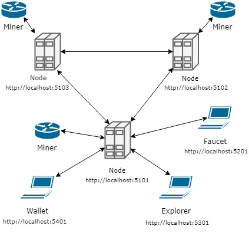
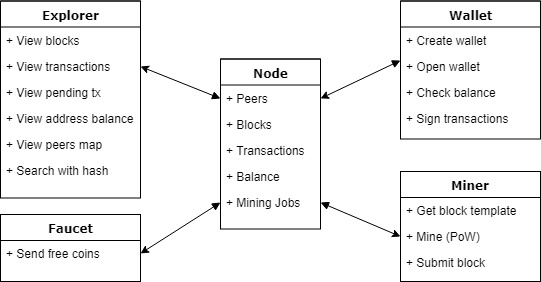
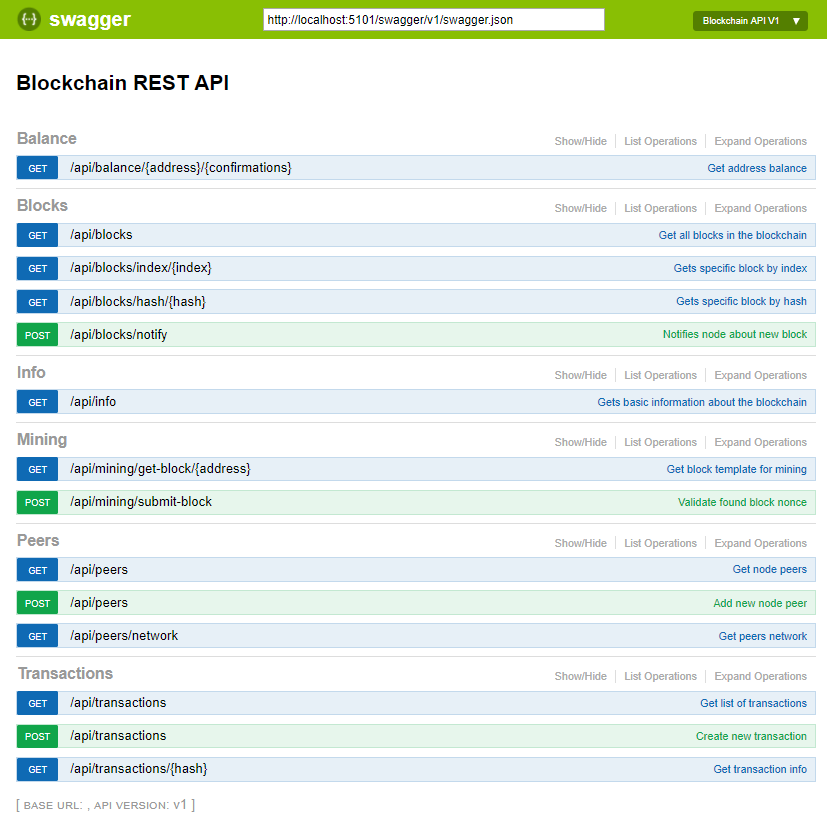
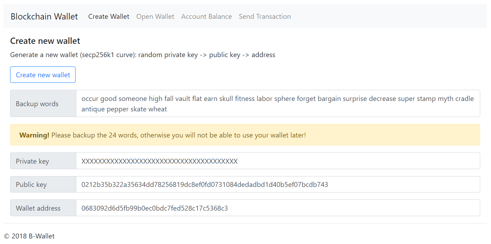
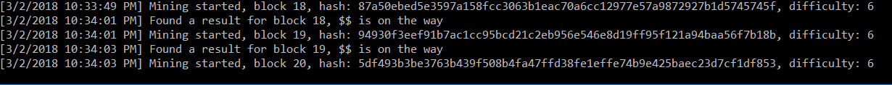
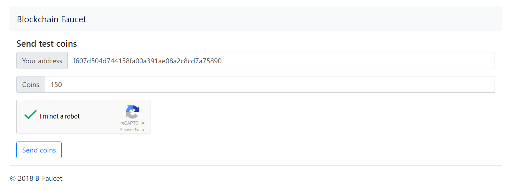
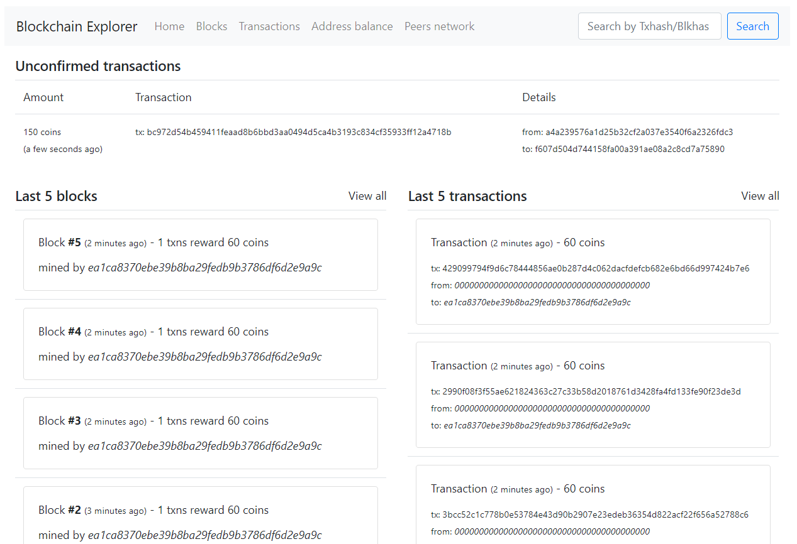

# .NET Core Blockchain

A fully-functional blockchain network consisting of Nodes (with peer-to-peer communication, blocks, transactions,
consensus, REST API), Mining software (using Proof-of-Work), Wallet software (handling private keys, signing and sending transactions), 
Faucet application (sending free coins) and Block Explorer application (to browse the blocks and transactions).

## Quick overview

Download the source code and run `$ ./run.bat rebuild`. This script will build all projects and create a simple test network will all applications.
The architecture of the network is defined as follows:

Note: You have to manually link the 3 running nodes using the REST API.

## Security

The project implements top-notch cryptographic algorithms to make sure your funds are safe.

Private/public key pairs are generated using `ECDSA and the secp256k1 curve` used by Bitcoin.

The private key is protected using 256-bit AES password-based encryption, to make sure that even if somebody manages to
steal your browser data, they won't get a hold of your funds. You can backup your private key, using 24-word mnemonic and a secret password.
Even if somebody got your words, they'd still need your password.

Each transaction is signed using your private key and verified by the nodes, using your public key.

## Mining 

Mining requires Proof of Work (PoW), with varying difficulty. This means that if someone wants to mine a lot of blocks (for the reward),
they would have to put considerable investment in hardware and time.
The work being done is a simple SHA256 hash of the blocks.

Each mined block gives the miner a variable reward (some pre-set bounty plus all the transaction fees in the block).

Whenever new transactions come in, the miner may choose to start mining the new more profitable block or keep mining the old one.

## Components

The main system components are: Node, Wallet, Miner, Faucet and Explorer.

### Node
The heart of the blockchain. Combine a few of those guys and you've got yourself a network.
Can work alone, but then it's not really distributed, is it? If you run a few of these guys, you can round them up in a network and they wil keep each other in sync.

* The node exposes a REST API that is used for communication in the network `http://localhost:5101/swagger`
* Consensus algorithm: Proof of Work (SHA256 hashing with difficulty, 6 leading zeros by default)
* Node synchronization accepts the chain with most work (~ the longest) for the main chain

#### Node API
The node exposes the following API endpoint categories:
* Balance - allows you to check a ballance of a wallet with a variable amount of confirmations
* Blocks - read all blocks (or a specific one), synchronize the blockchain (via push)
* Info - general info about the node
* Mining - API for miners to request block template for mining and submit found nonce (PoW)
* Peers - API for other nodes to hook up to and sync
* Transactions - allows you to get transaction data and to create new ones

#### Sync between nodes
When you have at least 2 nodes running, they will automatically sync, so they are up-to-date with each other's blocks and transactions.

In order to achieve that, nodes use the Peers API to notify the other nodes that they want to exchange info.
All node connections are bidirectional. (If Alice is connected to Bob, then Bob is also connected to Alice).

Once nodes are connected they will send each other notifications about changes in its blocks and/or transactions.

##### Consensus algorithm
The mechanism of synchronization is the following:
* Whenever a new transaction comes in, broadcast it to all peers
* Whenever a new block comes in, broadcast it to all peers
* Whenever another node broadcasts a transaction, put it in the pending list
* Whenever another node broadcasts a new block, check it for validity
	* If it's invalid, discard it
	* Otherwise, find if you have it's ancestor in the list
		* If yes, this means, that you just missed this one block. Attach it at the end.
		* If no, sync the whole blockchain - take the other guys chain, validate it (hashes and stuff), replace yours with theirs
		In both cases, purge the pending transactions (the ones already mined should be out of the pending list)

### Wallet
Front-end only web app that allows you to create and use a wallet, check your balance and push transactions to the blockchain.
It's so user-friendly and intuitive, that it barely needs any documentation at all.
Functionalities:
* Create Wallet - creates new private, public key and address for you and protects the private key using 256-bit AES password-based encryption
* Open Wallet - restores public key and address from 24 mnemonic words or a private key and password
* Account Balance - check current balance with specified blockchain confirmations
* Send Transaction - send coins to someone in the network. Beware! No valdiation address is available, so you can easily lose some funds. Transcation is signed after decrypting it with your password.

If you click on the title, a magical input will appear, allowing you to change the node URL,
in case you want to connect to a different node.

### Miner
A fully functional miner app that attaches to a node of your choice and mines new blocks to reap awards.
As simple as it gets, started from the command line via: `dotnet Miner.dll <Node_Url> <Miner_Address>`
It will mine till it dies. If node goes offline, it will sleep and wait for it to be back online.

The workflow is as follows:
* Requests from the node the next block candidate (with unconfirmed transactions) for mining
* Changes the nonce + timestamp in a loop until it finds a SHA256 hash starting with d zeroes (d == block difficulty)
* Submits the mined block hash to the Node and gets the next one

### Faucet
Free cash! Literally! This simple tool allows you to test your network, by giving you some free coins on demand.
It has anti-spam prevention, so you won't drain it at once.

* Holds some coins donated from the genesis transaction
* Works like a wallet with hard-coded private key
* Limits: one request per address per hour + captcha

### Explorer
The user-friendly application that allows you to see what's going on with the network. Data is cached and refreshed once every 10 seconds.
* Home - basic info about latest changes and unconfirmed transactions
* Blocks - all mined blocks available in the current node 
* Transactions - all mined transactions available in the current node

You can switch between pending and confirmed
* Address balance - allows you to check wallet balance
* Peers network - funky interactive map of the peers attached to the current node
* Search - top right - it allows you to easily find transactions and blocks via hash

